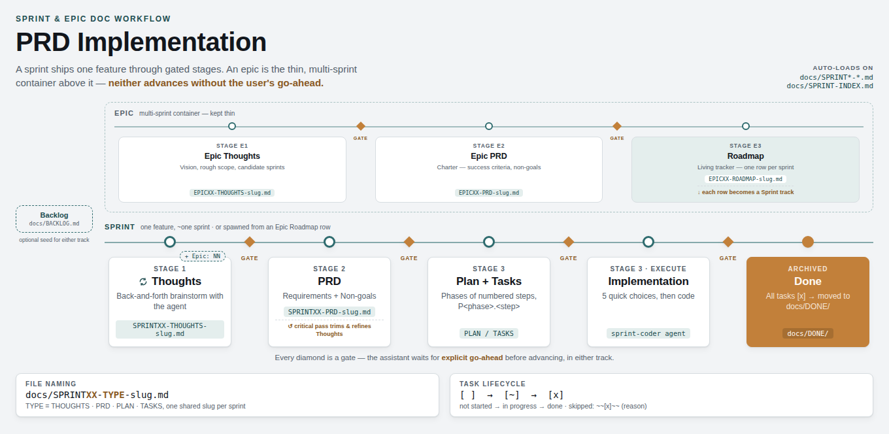

# AI Skills

A collection of extensions for AI coding agents: self-contained **Skills** (compatible with both [Cursor](https://docs.cursor.com/context/skills) and [Claude Code](https://code.claude.com/docs/en/skills)), plus a couple of Claude-Code-specific extras — importable **rules** and a **subagent**.

## Available Skills

| Skill | Description |
|-------|-------------|
| **json-tools** | Inspect, query, and manipulate JSON files using local scripts (Python & Node.js, no external dependencies). |
| **csv-tools** | Inspect, query, and manipulate CSV files using local Python scripts (stdlib only). Probe, filter, sort, group, stats, transform to JSON/JSONL, diff, validate; ignores footer/comment lines. |
| **usage-cost** | Aggregate Claude Code session usage + list-price cost over a configurable window from `~/.claude/projects/`. Per-day bar chart, per-project totals, top-N sessions, token totals (Python stdlib only). *Claude Code only — reads Claude Code's own session logs.* |
| **self-reflection** | End-of-conversation self-review that surfaces only genuinely critical observations — lessons learned, memory candidates, workflow recommendations. High bar: silent if there's nothing worth saying. Invoked explicitly, not auto-triggered. |

## Rules (Claude Code)

Plain markdown files meant to live in Claude Code's [`.claude/rules/`](https://code.claude.com/docs/en/memory#organize-rules-with-claude/rules/) directory — a different mechanism from Skills above, and not applicable to Cursor.

| Rule | Loads when | Description |
|------|-----------|-------------|
| [`prd-implementation.md`](prd-implementation.md) | Working with `docs/SPRINT*-*.md`, `docs/SPRINT-INDEX.md` (`paths:` frontmatter) | Gated Backlog → THOUGHTS → PRD → PLAN/TASKS → Implementation workflow for feature sprints. See the [one-page overview](docs/prd-implementation-slide.html). |
| [`epic-implementation.md`](epic-implementation.md) | Working with `docs/EPIC*-*.md`, `docs/EPIC-INDEX.md` (`paths:` frontmatter) | Multi-sprint EPIC container — THOUGHTS → PRD (charter) → ROADMAP — that decomposes into ordinary sprints run under the rule above. |
| [`avoid-bash-injection-heuristics.md`](avoid-bash-injection-heuristics.md) | Every session (no `paths:` field) | Reference for reshaping Bash commands to dodge Claude Code's "too-complex" parser heuristics instead of fighting them with permission rules. |

## Agents (Claude Code)

| Agent | Description |
|-------|-------------|
| [`sprint-coder`](agents/sprint-coder.md) | Implementation subagent for Stage 3 (PLAN/TASKS execution) of `prd-implementation.md` — flips TASKS checkboxes, ships code, self-verifies, and never commits/pushes/deploys unilaterally. |

> **Note:** `sprint-coder`'s persistent-memory path is hardcoded to the original author's machine — update the path in its "Persistent Agent Memory" section before relying on it.

## Docs

[](https://yzaremba.github.io/ai-skills/prd-implementation-slide.html)

- [PRD Implementation Workflow (slide)](https://yzaremba.github.io/ai-skills/prd-implementation-slide.html) — one-page overview of the [`prd-implementation.md`](prd-implementation.md) / [`epic-implementation.md`](epic-implementation.md) sprint & epic doc workflow.

## Installation

### Skills

#### Claude Code

Skills are auto-discovered from `.claude/skills/` (project) or `~/.claude/skills/` (personal, all projects) — no settings step needed.

```bash
# Project-level (this project only)
git clone https://github.com/yzaremba/ai-skills.git .claude/skills

# Personal (all projects)
git clone https://github.com/yzaremba/ai-skills.git ~/.claude/skills
```

#### Cursor

Clone into your project's `.cursor/skills/` directory:

```bash
git clone https://github.com/yzaremba/ai-skills.git .cursor/skills
```

Then add the skill in **Cursor Settings > Skills**, pointing to the `SKILL.md` inside the cloned directory. For a global install (all projects), clone to `~/.cursor/skills` instead and add it under Cursor's global scope.

Rules and the agent below are individual files rather than self-contained folders, so both start from one persistent clone (avoid `/tmp` here — it's typically wiped on reboot, which would leave symlinks into it dangling):

```bash
git clone https://github.com/yzaremba/ai-skills.git ~/ai-skills
```

### Rules (Claude Code only)

Drop the rule file(s) you want into `.claude/rules/` (project) or `~/.claude/rules/` (personal, all projects) — they're auto-discovered, no `@import` line needed. Symlinks work too, so you can keep the one clone above and link in only what you want:

```bash
mkdir -p ~/.claude/rules
ln -s ~/ai-skills/prd-implementation.md ~/.claude/rules/prd-implementation.md
ln -s ~/ai-skills/epic-implementation.md ~/.claude/rules/epic-implementation.md
ln -s ~/ai-skills/avoid-bash-injection-heuristics.md ~/.claude/rules/avoid-bash-injection-heuristics.md
```

(Swap `ln -s` for `cp` if you'd rather not depend on `~/ai-skills` sticking around.)

### Agents (Claude Code only)

Copy the agent file into `.claude/agents/` (project) or `~/.claude/agents/` (personal) — subagents are auto-discovered the same way:

```bash
cp ~/ai-skills/agents/sprint-coder.md ~/.claude/agents/sprint-coder.md
```

## License

Apache-2.0 — see [LICENSE.txt](LICENSE.txt).
